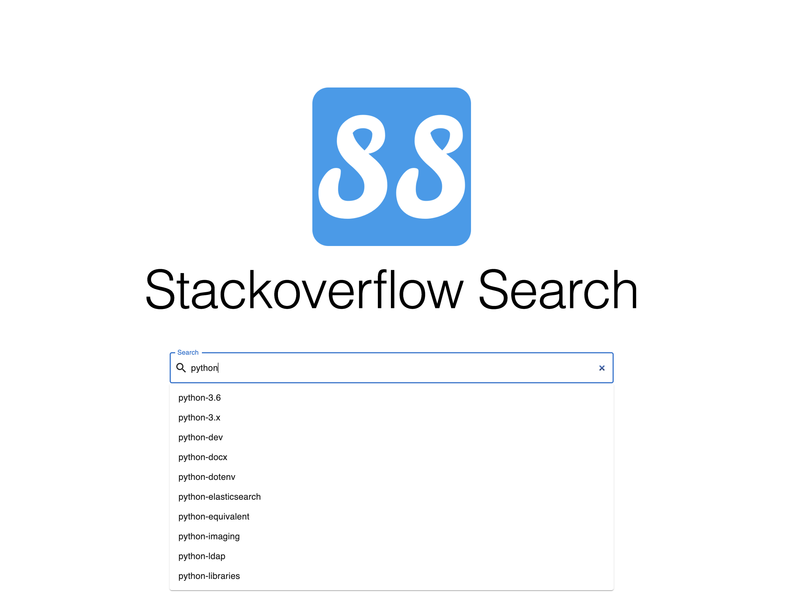

# Stackoverflow Search Engine

## Intro

Stackoverflow search engine is a simplified and self-used search engine. You can search with the keyword and check all the relative problems on stackoverflow.com. You can experience it here: [demo](https://stackoverflow-search.netlify.app/)

used Trie to realize the auto-suggestions on searching

display the results after searching

> all the data from stackoverflow.com are public

## Teck Stacks

* Spring Boot
* coreNLP
* Scrapy
* React.js
* Material UI
* MySQL
* MyBatis
* Nginx
* Guava

